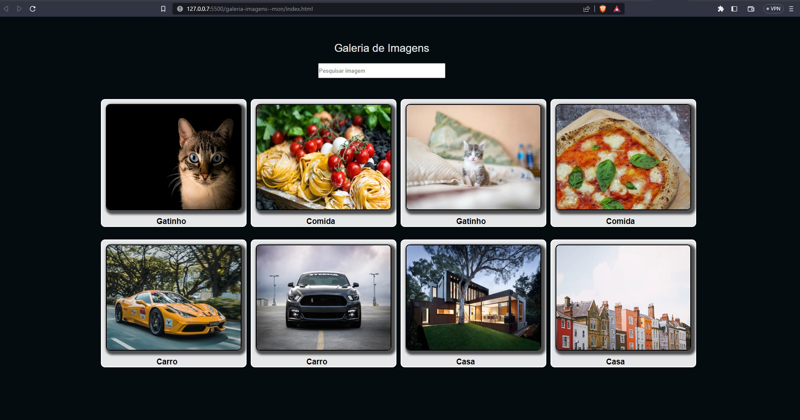

## 💻 About the project

💬 The landing page project was developed as an extension project during the scholarship monitoring program at UEPA (University of Pará state) in 2022. This project aimed to create a user-friendly gallery featuring a collection of photos, allowing users to easily filter and select their desired images. The project specifically catered to local high school students.

## 📝 Explanation

This extension project was developed with the objective of presenting embryonic knowledge of web development, integrating: HTML, CSS and JavaScript. In addition, important topics were highlighted such as best practices, tips and suggestions.

  
## 🔖 Objectives

- Introduce the class members to the principle of web development;
- Expose short knowledge in HTML, CSS and javascript.
- Explore in a practical way notions in HTML, CSS and javascript.
  

## 📑 Image 

